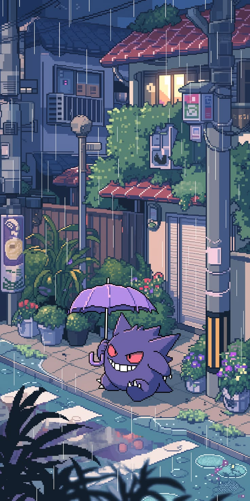

  

<h1 align="center">¡Hola! Soy Bryan Acosta 👋</h1>
<h3 align="center">Desarrollador Full Stack todo terreno 🚀</h3>

  

  
  
  

---

### 💡 Sobre mí

No me encasillo en una sola cosa. Construyo **sitios web**, **apps de escritorio**, **apps móviles**, **bots de automatización** y **extensiones de navegador**. Me gusta resolver problemas reales sin importar qué stack haga falta.

- 🔭 Actualmente trabajando en proyectos full stack con **Next.js + Supabase**
- 🌱 Explorando **NestJS** y arquitecturas con **Docker**
- 💬 Pregúntame sobre desarrollo web, apps de escritorio con Electron, o automatización
- ⚡ Versátil: si hay que aprender una tecnología nueva para resolver el problema, la aprendo

---

### 🛠️ Stack Tecnológico

**Frontend**

  
  
  
  
  
  

**Backend**

  
  
  

**Bases de Datos / BaaS**

  
  
  

**Móvil & Escritorio**

  
  
  

**Herramientas & DevOps**

  
  
  

---

### 🚀 Proyectos Destacados

<table>
  <tr>
    <td width="50%">
      <h4>🤝 CRM + OpenWA</h4>
      
CRM de gestión de clientes conectado a Supabase, integrado con una API propia de automatización de WhatsApp (OpenWA) que ejecuto de forma individual para potenciar la comunicación con clientes directamente desde el CRM.

      

        
        
        
        
        
      

    </td>
    <td width="50%">
      <h4>🛒 E-commerce</h4>
      
Plataforma de tienda virtual con catálogo de productos, autenticación y vista individual por producto.

      

        
        
        
      

    </td>
  </tr>
  <tr>
    <td width="50%">
      <h4>🖥️ Baay Client</h4>
      
Cliente/lanzador de aplicación de escritorio con manejo de autenticación, empaquetado y listo para distribución.

      

        
        
      

    </td>
    <td width="50%">
      <h4>🔐 Gestor de Contraseñas</h4>
      
Aplicación de escritorio para encriptar, guardar y administrar contraseñas con base de datos local.

      

        
        
      

    </td>
  </tr>
  <tr>
    <td width="50%">
      <h4>🐾 App Patitas</h4>
      
Aplicación Android empaquetada como Trusted Web Activity (TWA), llevando una experiencia web a una app nativa.

      

        
        
      

    </td>
    <td width="50%"></td>
  </tr>
</table>

> 📌 Más proyectos en mis [repositorios](https://github.com/ElBryan-dev?tab=repositories) — voy subiendo el resto progresivamente.

---

### 📊 Estadísticas de GitHub

  
  

---

  

  

